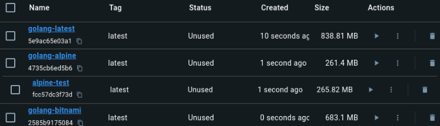

# Elección de la imagen de docker:

---

## Criterios:

- **Tamaño de la imagen:** Se valorará minimizar el tamaño del contenedor sin sacrificar funcionalidad, facilitando despliegues más rápidos y reduciendo el consumo de recursos.

- **Imágenes Oficiales y Verificadas:**  Las imágenes oficiales y de usuarios verificados ofrecen mayor confianza en términos de seguridad y mantenimiento. En Docker Hub esto se puede consultar viendo cuáles tienen las insignias de `Docker Official Image` o de `Verified Publisher`.

- **Soporte y actualizaciones regulares:**  Se valorará que las imágenes reciban actualizaciones frecuentes, ya que esto es importante para corregir posibles vulnerabilidades y mejorar funcionalidades. Además se deben evitar imágenes experimentales o sin soporte oficial, ya que pueden presentar problemas de estabilidad o falta de actualizaciones.
  
- **No ser versión específica:** Elegir una versión fija puede generar problemas de mantenimiento, se preferirán aquellas con etiquetas flotantes para asegurar que siempre se utilice la versión más reciente y segura.

---

## Candidatos:

### [Golang](https://hub.docker.com/_/golang):

Son las imágenes de Docker de Go, mantenidas de forma regular por la comunidad de Go. Todas tienen la insignia de `Docker Official Image`. Existen distintas variantes:

- **Basadas en Debian:**
 - `golang:latest`: Versión basada en Debian Bookworm, la cúal es la versión estable más reciente (Debian 12). Su última actualización fue hace dos semanas. 

- **Basadas en Alpine:**
  - `golang:<version>-alpine`: Imagen basada en Alpine Linux. Reduce el tamaño del contenedor. Su última actualización fue hace dos semanas. En Docker Hub se indica que es una variante experimental y no cuenta con soporte oficial por parte de Go. 
  - 
### [Alpine](https://hub.docker.com/_/alpine)

Cuenta con la insignia de `Docker Official Image`. Es útil para construir contenedores ligeros.

- `alpine:<latest>`: Su última actualización fue hace 20 días. Su tamaño es en torno a 3-4 MB, pero hay que tener en cuenta que tendríamos que instalar Go.

### [Bitnami/Golang](https://hub.docker.com/r/bitnami/golang):  
- `[bitnami/golang:<latest>](https://hub.docker.com/r/bitnami/golang)`: Cuenta con la insignia de `Verified Publisher`, su última actualización fue hace días. Tiene Go preinstalado y su tamaño suele ir en torno a los 230 MB.

# Decisión final:

Aunque todas las opciones cuentan con soporte y actualizaciones constantes, además de tener insignias que garantizan que son oficiales o verificadas, el criterio decisivo es el tamaño de cada imagen una vez que se instalan todas las herramientas necesarias. 

Aunque `golang:alpine` es la opción que ocupa menos espacio, es una variante experimental y no cuenta con soporte oficial directo del equipo de Go. Por este motivo, se ha decidido utilizar `alpine` como imagen base, ya que permite tener entorno más ligero, controlado y flexible, permitiendo instalar únicamente las herramientas necesarias y mantener el tamaño del contenedor reducido.